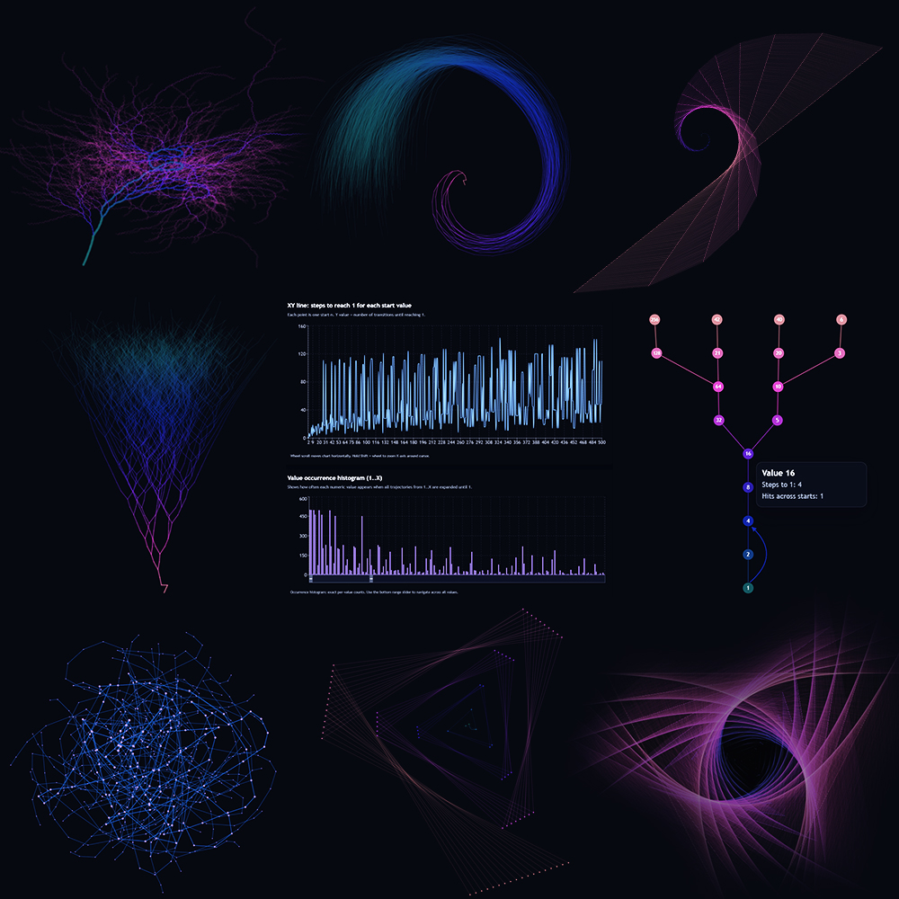

<div align="center">
  
  <h1>Collatz Visualizer</h1>
  <h3>Интерактивный проект для исследования гипотезы 3n + 1 (Collatz)</h3>
  <h3>⭐ <strong>Поставьте звезду репозиторию, если проект оказался полезным!</strong> ⭐</h3>
</div>
<div align="center">
  <a href="https://artasov.github.io/collatz-convergence/">
    
  </a>
</div>

<div align="center">
  <a href="./README.md">
    
  </a>
  <a href="./README_RU.md">
    
  </a>
</div>

## Что это за проект

`Collatz Convergence Explorer` вычисляет траектории Коллатца и показывает их в нескольких типах графиков:

- `XY line`: одна точка на каждое стартовое значение `n`, метрика - `steps to 1` или `peak value`.
- `Transition network (hairball)`: плотный ориентированный граф переходов `n -> f(n)`.
- `Convergence tree (2D)`: обратное слоистое дерево от корня `1`.
- `3D coral tree`: 3D-проекция обратного дерева для пространственного анализа.
- `Single number trace`: полный путь для одного выбранного стартового числа.

Цель проекта — сделать поведение, масштаб и структуру траекторий более понятными и наглядными.

## [LIVE DEMO](https://artasov.github.io/collatz-convergence/)

## Гипотеза Коллатца (кратко)

Для положительного целого `n`:

- если `n` чётное: следующее значение `n / 2`
- если `n` нечётное: следующее значение `3n + 1`

Гипотеза утверждает, что любое положительное стартовое значение в итоге попадает в цикл `4 -> 2 -> 1`.

## Почему это интересно

- Очень простое правило и при этом нетривиальное глобальное поведение.
- Сильное сочетание теории чисел, графовых структур и вычислений.
- Легко экспериментировать, но сложно доказать в общем виде.

## Полезные материалы

- Wikipedia: https://en.wikipedia.org/wiki/Collatz_conjecture
- MathWorld: https://mathworld.wolfram.com/CollatzProblem.html
- OEIS (последовательности, связанные с Collatz): https://oeis.org/wiki/Collatz_conjecture
- Numberphile (вводное видео): https://www.youtube.com/watch?v=094y1Z2wpJg

## Архитектура

Структура проекта:

- `backend`: FastAPI, domain/services/repositories, хранение в PostgreSQL
- `frontend`: React + Vite + MUI, UI и визуализации
- `docs/er-diagram.md`: ER-диаграмма схемы PostgreSQL `collatz`

## [ER-диаграмма базы данных](docs/er-diagram.md)

## Docker

- Скопируйте пример env:

```bash
cp .env.example .env
```

- Поднимите все сервисы (`db + backend + frontend`):

```bash
docker compose up --build
```

- Адреса:
    - Frontend: http://localhost:5173
    - Backend API: http://localhost:8000
    - Swagger: http://localhost:8000/docs

- Примечание: backend-контейнер автоматически запускает `alembic upgrade head` перед стартом `uvicorn`.

## Ручной запуск

### Backend

```bash
cd backend
poetry install
# укажите DATABASE_URL в backend/.env
poetry run uvicorn app.main:app --reload --port 8000
```

### Frontend

```bash
cd frontend
npm install
npm run dev
```
