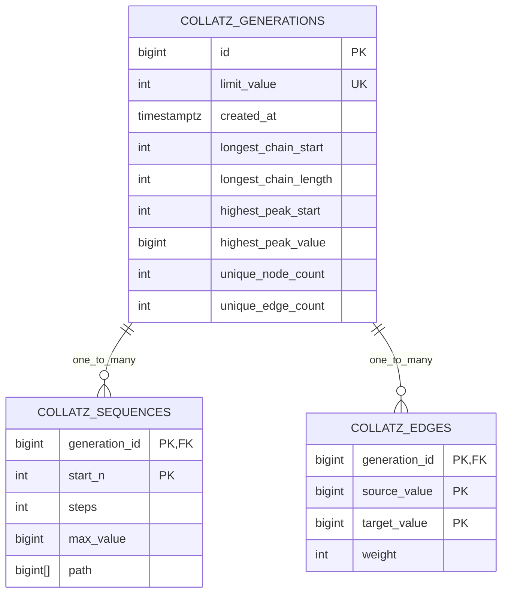

# ER Diagram

Schema: `collatz`

Notes:

- `collatz.generations.limit_value` is unique (`uq_generations_limit_value`).
- `collatz.sequences` primary key is (`generation_id`, `start_n`).
- `collatz.edges` primary key is (`generation_id`, `source_value`, `target_value`).
- `collatz.sequences.generation_id` and `collatz.edges.generation_id` use `ON DELETE CASCADE`.
- Indexes:
    - `idx_sequences_generation_id`
    - `idx_edges_generation_id`
